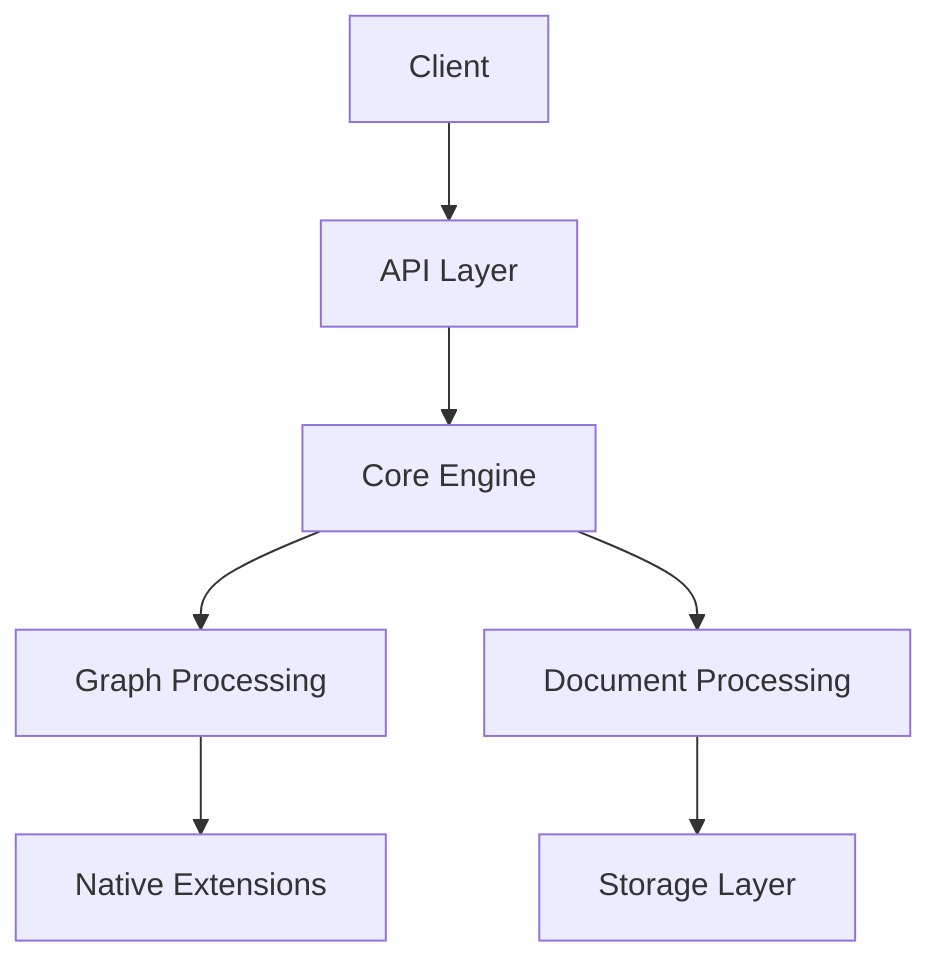

# GraphFleet Architecture

This document provides a comprehensive overview of GraphFleet's architecture, its core components, and how they interact.

## System Overview

GraphFleet is designed as a distributed system with three main components:

1. Core Engine (graphfleet)
2. Graph Processing Library (graspologic)
3. Native Extensions (graspologic-native)



## Core Components

### 1. Core Engine (graphfleet)

The core engine handles:

- Document ingestion and processing
- Knowledge graph construction
- Query processing and optimization
- Data persistence and retrieval

Key features:
- Modular pipeline architecture
- Pluggable storage backends
- Extensible query language
- Real-time and batch processing support

### 2. Graph Processing Library (graspologic)

Graspologic provides:

- Graph algorithms implementation
- Analytics and metrics computation
- Visualization capabilities
- Graph embedding and ML models

Key features:
- Efficient graph operations
- Scalable to large graphs
- GPU acceleration support
- Rich visualization toolkit

### 3. Native Extensions (graspologic-native)

Performance-critical operations implemented in Rust:

- SIMD-optimized graph operations
- Custom memory management
- High-performance data structures
- Native bindings to Python

## Data Flow

1. **Document Ingestion**
   ```mermaid
   sequenceDiagram
       participant Client
       participant API
       participant Processor
       participant Storage
       
       Client->>API: Submit Document
       API->>Processor: Process Document
       Processor->>Storage: Store Document
       Processor->>Storage: Update Index
   ```

2. **Query Processing**
   ```mermaid
   sequenceDiagram
       participant Client
       participant API
       participant QueryEngine
       participant GraphProcessor
       
       Client->>API: Submit Query
       API->>QueryEngine: Parse Query
       QueryEngine->>GraphProcessor: Execute Query
       GraphProcessor->>Client: Return Results
   ```

## Storage Architecture

GraphFleet uses a multi-layer storage architecture:

1. **Document Store**
   - Raw document storage
   - Document metadata
   - Version control

2. **Graph Store**
   - Knowledge graph data
   - Graph indices
   - Temporal data

3. **Index Store**
   - Search indices
   - Embedding vectors
   - Cache data

## Security Architecture

1. **Authentication**
   - JWT-based authentication
   - OAuth2 support
   - Role-based access control

2. **Data Security**
   - End-to-end encryption
   - At-rest encryption
   - Audit logging

## Deployment Architecture

GraphFleet supports multiple deployment models:

1. **Single Instance**
   - All components on one machine
   - Suitable for development/testing

2. **Distributed**
   - Components distributed across machines
   - Horizontal scaling
   - Load balancing

3. **Hybrid**
   - Mix of local and distributed components
   - Cloud-native support
   - Edge computing support

## Performance Considerations

1. **Caching Strategy**
   - Multi-level caching
   - Cache invalidation policies
   - Distributed cache support

2. **Query Optimization**
   - Query planning
   - Cost-based optimization
   - Parallel execution

3. **Resource Management**
   - Memory pooling
   - Connection pooling
   - Thread management

## Monitoring and Observability

1. **Metrics**
   - System metrics
   - Business metrics
   - Performance metrics

2. **Logging**
   - Structured logging
   - Log aggregation
   - Error tracking

3. **Tracing**
   - Distributed tracing
   - Performance profiling
   - Bottleneck analysis

## Future Considerations

1. **Scalability**
   - Improved distributed processing
   - Better resource utilization
   - Enhanced caching strategies

2. **Features**
   - Advanced ML capabilities
   - Real-time processing
   - Enhanced visualization

3. **Integration**
   - More storage backends
   - Additional ML frameworks
   - External system connectors 